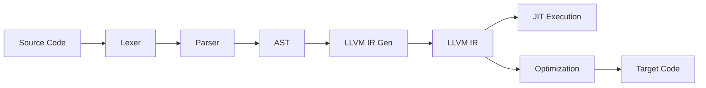

<div align="center">


# Sig Programming Language

*A modern compiled systems programming language powered by LLVM*

[]()
[]()
[]()
[]()

</div>

## About

Sig is a modern systems programming language that combines high-level expressiveness with low-level control. Built on LLVM infrastructure, Sig provides portable, optimized compilation while maintaining a clean, intuitive syntax perfect for system development, kernel programming, and high-performance applications.

### Key Features
- **LLVM-Powered**: Leverages LLVM's world-class optimization and multi-target support
- **High-Level Syntax**: Clean, expressive syntax familiar to modern developers
- **JIT & AOT Compilation**: Execute immediately with JIT or compile to optimized binaries
- **Cross-Platform**: Target multiple architectures through LLVM backend
- **Memory Safe**: (Planned) Safe memory management with zero-cost abstractions
- **Systems Ready**: Direct hardware access and inline assembly when needed

## Current Status

**Active Development**: Sig has migrated to LLVM and core features are working!

### Implemented Features
- [x] LLVM-based compilation pipeline
- [x] **Native executable generation** - Creates optimized binaries
- [x] **JIT execution** with LLVM ORC for immediate testing
- [x] **Custom output names** with `-o` flag support
- [x] Variables and basic types (integers, strings)
- [x] Print statements and I/O
- [x] Function definitions and calls
- [x] LLVM IR generation and optimization
- [x] Cross-platform compilation support

### In Progress
- [x] Control flow (if/else, loops) - Done
- [ ] Expression evaluation and operators - Might be next
- [ ] Type system and type checking - Might not have types
- [x] Standard library foundation - Partial

### Roadmap
- [ ] Structs and enums
- [ ] Advanced memory management
- [x] Module system and imports
- [ ] Standard library expansion - This will be a builtin - Partial Implementation
- [ ] Package manager integration
- [ ] IDE tooling and language server

## Installation

### Prerequisites
- **CMake 3.20+**
- **LLVM 18+** (with development headers)
- **C++23 compatible compiler** (GCC 12+, Clang 15+)
- **Linux/macOS/Windows** (WSL supported)

### Install LLVM
```bash
# Ubuntu/Debian
sudo apt install llvm-dev clang cmake

# Arch Linux
sudo pacman -S llvm clang cmake

# macOS
brew install llvm cmake

# Or build LLVM from source for latest features
```

### Build from Source
```bash
git clone https://github.com/GhostedGaming/sig-language.git
cd sig-language
./build.sh
```

### Install System-Wide
To use `sig` from anywhere in your terminal:
```bash
# Build and install in one step
./build.sh --install

# Or install after building
./install.sh

# Uninstall if needed
./uninstall.sh
```

This installs the compiler to `~/.local/bin` (or `~/bin`) and provides PATH setup instructions.

## 📖 Usage

Sig supports multiple compilation and execution modes:

### Compile to Executable (Default)
Create a native executable:
```bash
sig program.sg                 # Creates 'program' executable
sig program.sg -o myapp        # Creates 'myapp' executable  
```

### JIT Execution
Execute code immediately without creating files:
```bash
sig program.sg --jit
```

### LLVM IR Generation
View the generated LLVM IR:
```bash
sig program.sg --ir
```

### Legacy Mode
Use the original x86-64 assembly backend:
```bash
sig program.sg --legacy
```

## Language Examples

### Basic Hello World
```sig
// examples/hello_world.sg
print("Hello, World!");
```

### Variables and Types
```sig
// examples/variables.sg
let x = 42;              // Integer
let message = "Hello!";  // String
print(x);
print(message);
```

### Functions
```sig
// examples/functions.sg
fn greet() {
    print("Hello from function!");
}

greet();  // Call the function
```

### Running Examples
```bash
# Compile to executable (default)
sig examples/hello_world.sg
./hello_world

# Custom output name
sig examples/variables.sg -o myvars
./myvars

# Execute with JIT
sig examples/functions.sg --jit

# View LLVM IR
sig examples/variables.sg --ir
```

## Architecture

Sig uses a modern LLVM-based compilation pipeline:



### Pipeline Stages
1. **Lexer**: Tokenizes source code into meaningful symbols
2. **Parser**: Builds Abstract Syntax Tree (AST) from tokens
3. **LLVM IR Generator**: Converts AST to LLVM Intermediate Representation
4. **LLVM Backend**: Handles optimization and target code generation
5. **Execution**: JIT compilation or static binary generation

### Key Components
- **Frontend**: Custom lexer/parser for Sig syntax
- **Backend**: LLVM infrastructure for optimization and code generation
- **Runtime**: LLVM ORC JIT for immediate execution
- **Legacy Support**: Original x86-64 assembly backend (deprecated)

## Contributing

We welcome contributions! Sig is rapidly evolving and there are many opportunities to contribute.

### Development Setup
```bash
git clone https://github.com/GhostedGaming/sig-language.git
cd sig-language
make  # Build the compiler
./sig examples/hello_world.sg  # Test it works
```

### Priority Areas
- **Language Features**: Implement control flow, operators, type system
- **Standard Library**: Build essential functions and data structures  
- **Tooling**: IDE integration, debugger support, package manager
- **Documentation**: Examples, tutorials, language specification
- **Testing**: Comprehensive test suite and benchmarks
- **Platform Support**: Windows native, macOS optimization

### How to Contribute
1. Fork the repository
2. Create a feature branch (`git checkout -b feature/amazing-feature`)
3. Commit your changes (`git commit -m 'Add amazing feature'`)
4. Push to the branch (`git push origin feature/amazing-feature`)
5. Open a Pull Request

## Documentation

- **Examples**: See `examples/` directory for working code samples
- **Language Guide**: *(Coming Soon)*
- **API Reference**: *(Coming Soon)*
- **LLVM Integration**: *(Coming Soon)*

## Development

### Project Structure
```
sig-language/
├── src/
│   ├── lexer/          # Tokenization
│   ├── parser/         # Syntax analysis  
│   ├── ast/            # Abstract Syntax Tree
│   ├── codegen/        # LLVM IR generation
│   └── main.cpp        # Compiler entry point
├── examples/           # Example programs
├── CMakeLists.txt      # Build configuration
└── README.md          # This file
```

### Building with Debug Info
```bash
cmake -DCMAKE_BUILD_TYPE=Debug .
make
gdb ./sig examples/hello_world.sg
```

## License

This project is licensed under the MIT License - see the [LICENSE](LICENSE) file for details.

## Acknowledgments

- **LLVM Project**: For providing world-class compiler infrastructure
- **Systems Languages**: Inspired by C, C++, Rust, and Zig
- **Community**: Thanks to all contributors and early adopters
- **Modern Compiler Design**: Built with contemporary best practices

---

<div align="center">
<strong>Star this repo if you're excited about Sig's development!</strong>

**[Try Sig Now](#installation) • [Join Development](#contributing) • [View Examples](examples/)**
</div>
